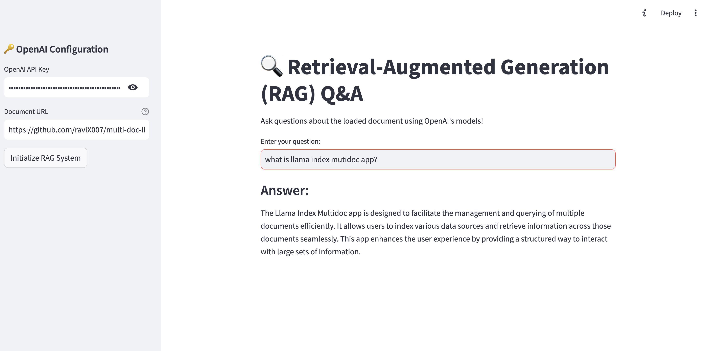

# LangGraph Webpage RAG Assistant

A powerful Retrieval-Augmented Generation (RAG) system that allows users to query webpage content using LangGraph and OpenAI's models. The application extracts content from webpages, processes it using RAG architecture, and provides accurate answers to user questions.

## 🔥 Features

- 🌐 Dynamic webpage content extraction
- 📑 Automatic text chunking and processing
- 🔍 Advanced RAG implementation using LangGraph
- 💡 Interactive Q&A interface
- 📊 Context-aware responses
- 🔄 Real-time processing
- 📝 Source context display

## 🏗️ Architecture


## 🛠️ Technical Stack

- **LangGraph**: Core RAG functionality
- **OpenAI**: LLM and embeddings
- **Streamlit**: Web interface
- **BeautifulSoup**: Web scraping
- **LangChain**: Document processing

## 📦 Installation

1. Clone the repository:

```bash
git clone https://github.com/ravix007/langgraph-webpage-rag.git
cd langgraph-webpage-rag
```

2. Install dependencies:

```bash
pip install -r requirements.txt
```

3. Create requirements.txt with:

```
streamlit
beautifulsoup4
langchain
langgraph
openai
requests
```

## 🔑 Configuration

You'll need:

- OpenAI API key
- Web page URL to process

## 🚀 Usage

1. Start the application:

```bash
streamlit run app.py
```

2. In the web interface:
   - Enter your OpenAI API key
   - Provide webpage URL
   - Initialize the RAG system
   - Start asking questions!

## 🔍 Core Components

### Webpage Processing

- Content extraction using BeautifulSoup
- Text sanitization
- Unicode handling

### RAG Implementation

- Document chunking
- Vector storage
- Similarity search
- Context retrieval

### LangGraph Pipeline

- State management
- Sequential processing
- Context-aware generation

## 📊 Project Structure

```
langgraph-webpage-rag/
├── app.py              # Main application
├── requirements.txt    # Dependencies
├── README.md          # Documentation
└── .gitignore         # Git ignore file
```

## ⚠️ Limitations

- Requires OpenAI API key
- Web page must be accessible
- Processing time varies with content length
- Memory-based vector store (not persistent)

## Screenshot of working application


